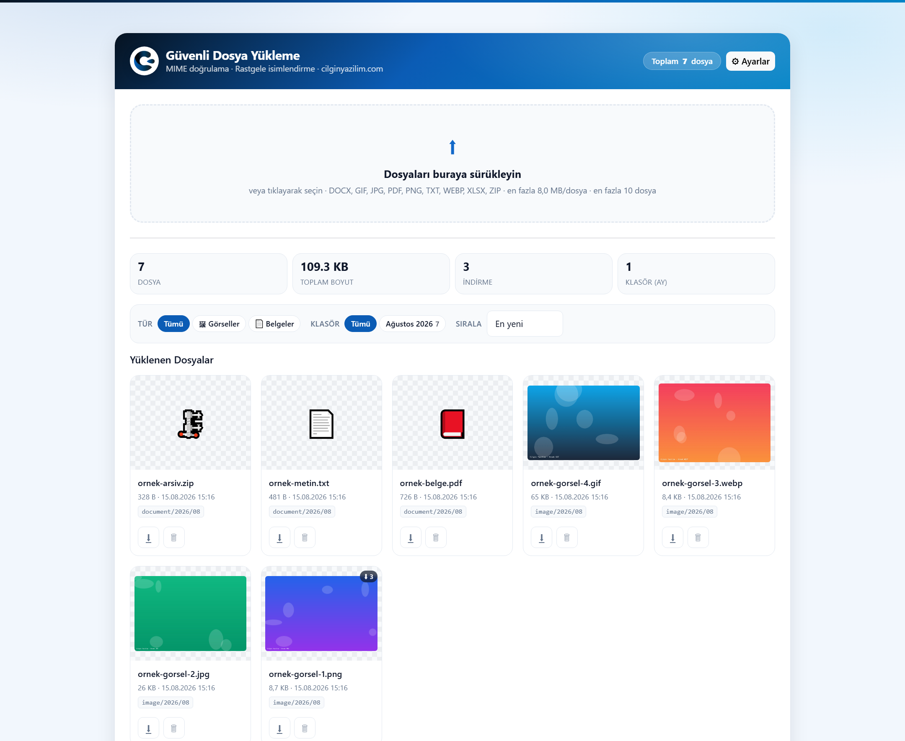
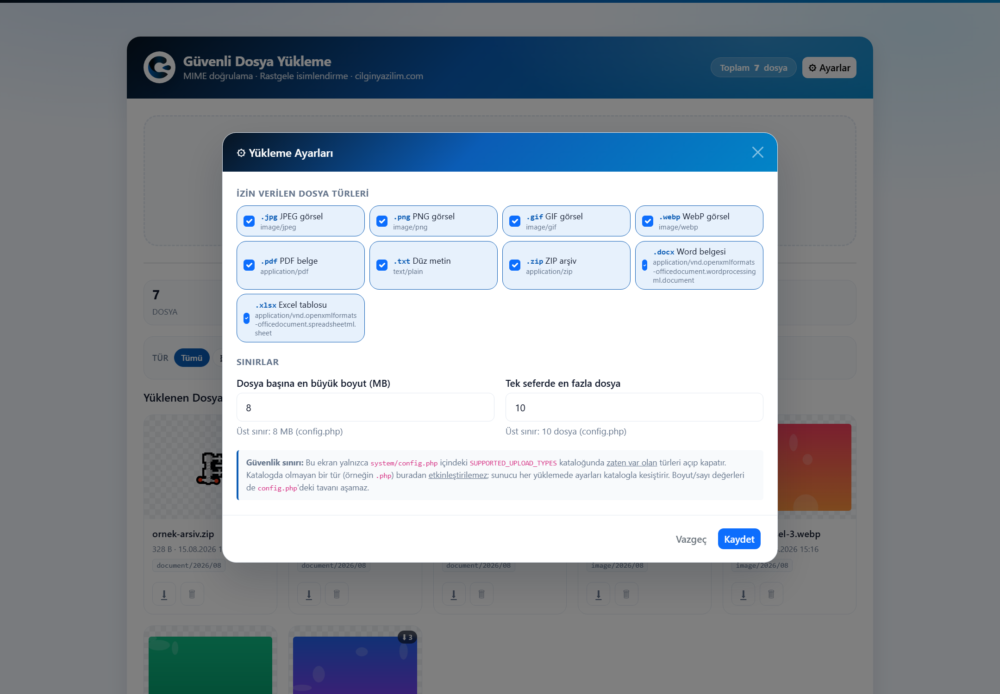

<div align="center">


# Secure File Upload System

A PHP file upload example built on **layered security**.
Drag & drop · Progress bars · Type/date foldering · Download counter · Configurable type whitelist
Search · Grid/list view · Image lightbox · Light/dark theme · **Mobile-friendly UI**

**[cilginyazilim.com](https://cilginyazilim.com)** · MIT License · Version **1.2.0**

**[📚 Code Library](https://cilginyazilim.com/kutuphane)** · [This application's page](https://cilginyazilim.com/kutuphane/uygulama/secure-file-upload/)

[🇹🇷 Türkçe](README.md) · 🇬🇧 English

</div>

---

<div align="center">

## Live Demo

**No setup, no sign-up, no download — try it in your browser in 3 seconds.**

<a href="https://cilginyazilim.com/kutuphane/uygulama/secure-file-upload/"></a>
<a href="https://cilginyazilim.com/kutuphane/guvenli-dosya-yukleme"></a>
<a href="https://github.com/CilginYazilim/secure-file-upload/archive/refs/heads/main.zip"></a>

<br><br>

<a href="https://cilginyazilim.com/kutuphane/uygulama/secure-file-upload/" title="Click to open the live demo">
  
</a>

<sub>▲ Click the image to open the demo</sub>

</div>

> **Upload the sample files, then try a PHP file renamed to .png and watch it get rejected.**

---

## Table of contents

- [What this project does](#what-this-project-does)
- [Layered security defense](#layered-security-defense)
- [Measured findings](#measured-findings-and-closed-vulnerabilities)
- [File layout](#file-layout-and-what-each-file-does)
- [Function reference](#function-reference)
- [On-disk folder structure](#on-disk-folder-structure)
- [Settings screen](#settings-screen)
- [UI features and mobile support](#ui-features-and-mobile-support)
- [API endpoints](#api-endpoints)
- [Database schema](#database-schema)
- [Installation](#installation)
- [Customization](#customization)
- [Example use cases](#example-use-cases)
- [Changelog](#changelog)

---

## What this project does

A general-purpose file upload system: it accepts images (JPG/PNG/GIF/WEBP) and documents (PDF/TXT/ZIP/DOCX/XLSX), organizes them by type and date, then lists, filters, downloads, counts and deletes them.

The focus is **security, not the interface.** File upload is the most dangerous feature a web application can expose: done wrong, an attacker uploads code and executes it on your server (*remote code execution*). This repository shows how to close that risk layer by layer, **with measured evidence**.

> **This repository is both a tutorial and a portfolio piece.** Every decision is justified in Turkish comments inside the code itself. It does not say "we did this" — it explains **why we did it this way and why the alternative was insufficient.**

---

## Layered security defense

Each layer is designed to stand on its own **even if the others are bypassed** (*defense in depth*). The table below states **why each layer exists**.

| # | Layer | Where | Why it's there |
|---|-------|-------|----------------|
| 1 | **MIME detection from content** | `store_upload()` — `finfo` | The client's `Content-Type` header is **text an attacker wrote**, not validation. `finfo` reads the file's first bytes ("magic bytes"), which cannot be faked without actually changing the content. |
| 2 | **Catalog whitelist** | `config.php` | A blacklist ("these are forbidden") is always incomplete — one forgotten extension breaks everything. A whitelist makes the default *deny*. SVG is deliberately excluded: it is an XML format that can embed `<script>`. |
| 3 | **Extension derived from MIME** | `store_upload()` | The user's filename **never** determines the name written to disk. Send `invoice.pdf.php` and, if the content is a PDF, it lands as `.pdf`; `.php` never reaches the disk. The double-extension attack dies on this line. |
| 4 | **Random filename** | `random_bytes(16)` | Three benefits: prevents overwrites, stops information in the original name from leaking into URLs, and makes guessing someone else's file URL impossible. |
| 5 | **Real image decoding** | `imagecreatefromstring()` | `getimagesize()` does **not** decode the file, it only reads the header — it passes a file with a forged header (see [measurement](#2-image-validation-bypass-getimagesize-is-not-enough)). Real decoding via GD eliminates polyglot files. |
| 6 | **Pixel bomb limit** | `store_upload()` | An image above 50 MP demands hundreds of MB while decoding. It is rejected **before** decoding, so a small file cannot take the server down. |
| 7 | **`.htaccess` execution lock** | `uploads/.htaccess` | Even if **all** of layers 1–6 are bypassed and a `.php` file lands on disk, Apache will not execute any script in that folder. Last-resort defense. It is inherited by subfolders (measured). |
| 8 | **`nosniff` + CSP** | `uploads/.htaccess` | Some browsers ignore `Content-Type`, inspect the content and decide "this is actually HTML" (*MIME sniffing*), then run it **on your own domain** → stored XSS. `nosniff` forbids this; the CSP `sandbox` is the second belt. |
| 9 | **Forced download headers** | `download.php` | `application/octet-stream` + `attachment`: the browser **never** renders the content as a page, it only downloads it. |
| 10 | **Header injection sanitizing** | `download_filename_header()` | If a filename goes into an HTTP header, then **user input is being written into a header**. Without stripping quotes/semicolons an attacker can break out of it (see [measurement](#1-content-disposition-header-injection-remotely-reachable)). |
| 11 | **CSRF token** | `require_csrf()` | Every state-changing request (upload, delete, settings) requires a session-bound token, so another site cannot act on your behalf. |
| 12 | **Settings ≠ security boundary** | `allowed_upload_types()` | Settings live in the database, and databases change. The effective list is always computed as `catalog ∩ settings` — writing `.php` into settings does not enable it. |

---

## Measured findings and closed vulnerabilities

Every item here is a **measurement, not a guess**: attempted with real HTTP requests, result recorded, fixed, then retested.

### 1) `Content-Disposition` header injection (remotely reachable)

**Finding.** `download.php` wrote the database's `original_name` straight into the header. `basename()` strips path information but **does not strip quotes**.

PHP's multipart upload parser normally blocks a quote — unless it is escaped with a backslash:

```http
Content-Disposition: form-data; name="files[]"; filename="a\"; filename=setup.exe.png"
```

This request was accepted as an ordinary upload and stored this name in the database:

```
a"; filename=setup.exe.png
```

The download header the server then produced (measured):

```http
Content-Disposition: attachment; filename="a"; filename=setup.exe.png"
                                            ↑ broke out, SECOND filename parameter
```

So an **unauthenticated uploader** could inject a second `filename` parameter into the download header. Some clients honor the last one, saving the file under a name the user never expected (e.g. `.exe`).

**Fix.** `download_filename_header()` emits two representations: a sanitized ASCII form (`" \ ;` and control characters become `_`) plus an RFC 5987 percent-encoded UTF-8 form.

**Measurement after the fix:**

```http
Content-Disposition: attachment; filename="a__ filename=setup.exe.png"; filename*=UTF-8''a%22%3B%20filename%3Dsetup.exe.png
                                          ↑ single parameter, no break-out
```

This also fixed a usability bug: Turkish filenames were mangled because raw UTF-8 bytes were placed in a header field defined as ISO-8859-1. `Şirket Faturası ÇĞİÖŞÜ.png` now round-trips correctly via `filename*`.

### 2) Image validation bypass (`getimagesize()` is not enough)

**Finding.** Layer 5 used `getimagesize()`, which does **not** decode the file — it only reads the header.

Sending a file whose content was `GIF89a<?php system($_GET["c"]); ?>`:

| Check | Result |
|---|---|
| `finfo` | `image/gif` (first 6 bytes are the GIF signature) |
| `getimagesize()` | **PASSED** — and reported a fabricated `16188x26736` size (it read the PHP code bytes as width/height) |
| Outcome | The file **was written to disk** |

A subtler variant (a valid 100×100 header followed by PHP code) behaved the same: `getimagesize()` → `PASSED (100x100)`.

**Fix.** Real decoding via `imagecreatefromstring()` plus a 50 MP pixel limit.

**Measurement after the fix** (same 100×100 polyglot):

```
getimagesize          -> PASSED (100x100)    ← the old layer would still bleed
imagecreatefromstring -> REJECTED            ← the new layer caught it
server response       -> {"success":false,"description":"... not a valid image (content could not be decoded)."}
```

A legitimate PNG uploaded fine in the same test — the fix did not break normal use.

### 3) No security headers in the upload folder

**Finding.** `download.php` responses carried `nosniff`, but the **direct access** path used by thumbnail previews had no security headers at all:

```http
GET /uploads/....gif
Content-Type: image/gif        ← no other headers
```

Embed HTML inside a GIF/PNG and, if the browser sniffs the content, the script runs **on your own domain** (stored XSS).

**Fix + measurement:**

```http
X-Content-Type-Options: nosniff
Content-Security-Policy: default-src 'none'; img-src 'self'; style-src 'unsafe-inline'; sandbox
X-Frame-Options: DENY
```

### 4) CSRF rejection returned HTTP 500

**Finding.** `require_csrf()` returned `419` on failure. `419` is not an official HTTP status code (a Laravel invention), and **on this stack Apache silently rewrote it to `500`** — so the client believed the server had crashed.

```
bad token -> HTTP 500      (before)
bad token -> HTTP 403      (after)
```

### 5) `.htaccess` lock — verified, no bypass found

This layer **could not be bypassed**. Paths attempted, all returning `403`:

```
uploads/zz.php            uploads/zz.php/         uploads/./zz.php
uploads//zz.php           uploads/ZZ.PHP          uploads/zz.php.
uploads/zz.phtml          uploads/zz.php%00.png   (404)
uploads/image/2026/08/zz.php   ← applies in subfolders too
```

Directory listing is disabled at every level (`403`).

### 6) Path traversal — defense verified

`safe_upload_path()` rejected **all** of the following and accepted the legitimate path:

```
../../system/config.php                      -> REJECTED
image/2026/08/../../../../system/config.php  -> REJECTED
image/2026/08/../../../.htaccess             -> REJECTED
..\..\system\config.php                      -> REJECTED
image/2026/08/%2e%2e%2fconfig.php            -> REJECTED
document/2026/08/AAAA.php                    -> REJECTED
image/2026/08/deada12d...474.png             -> accepted  ← legitimate
```

### 7) SQL injection — defense verified

`id; DROP TABLE files; --` was sent as the sort parameter. Since a sort column cannot be a bound parameter, it is chosen from a **whitelist**; the input matched nothing, fell back to the default, and the table survived.

### 8) Settings security boundary — verified

A save request added `application/x-php` and `application/x-httpd-php`, and asked for `500 MB` / `9999` files:

```
ENABLED types: image/png                   ← the .php types were silently dropped
max_bytes=8388608  max_files=10            ← clamped to the ceiling
```

---

## File layout and what each file does

```
secure-file-upload/
├── index.php                  ← UI: drag & drop, search, filters, summary, settings + lightbox modals
├── .env.example               ← Database credentials (optional) — in .gitignore
├── cy_upload.sql              ← Database setup (files + settings tables)
│
├── system/
│   ├── config.php             ← Settings, TYPE CATALOG, limit ceilings, PDO connection
│   ├── function.php           ← Core: validation, storage, settings, path safety
│   ├── ajax.php               ← JSON endpoint (list / upload / delete / settings)
│   └── download.php           ← Download endpoint (GET, forced attachment, counter)
│
├── assets/
│   ├── css/cilginyazilim.css  ← SHARED BRAND TEMPLATE — do not modify
│   ├── css/style.css          ← Page-specific styles only + mobile support
│   ├── js/upload.js           ← Drag & drop, progress, search, filters, theme, settings UI
│   └── images/                ← Logo + screenshots
│
├── ornek-dosyalar/            ← Ready-made samples to try (PNG/JPG/WEBP/GIF/PDF/TXT/ZIP)
│
└── uploads/                   ← Uploaded files (type/year/month tree)
    └── .htaccess              ← Execution lock + security headers
```

### Separation of responsibilities

| File | Responsible for | **Not** responsible for |
|---|---|---|
| `index.php` | Rendering HTML only | Makes no security decisions |
| `upload.js` | User experience only | **None of its checks are security** — JS can be skipped |
| `config.php` | Catalog + ceilings | Contains no business logic |
| `function.php` | All security decisions | Produces no output (aside from JSON helpers) |
| `ajax.php` | Request routing + authorization | Contains no validation logic; delegates to `function.php` |

> **Golden rule:** the type and size checks in `upload.js` are **not security.** An attacker can post directly to `system/ajax.php` without ever running the JavaScript. Real validation always lives on the server.

---

## Function reference

### `system/function.php`

| Function | What it does |
|---|---|
| `e()` | HTML escaping (`htmlspecialchars`) — output sanitizing against XSS |
| `json_response()` / `json_success()` / `json_error()` | Uniform JSON responses; adds `nosniff` to every one |
| `csrf_token()` | Creates/returns a session-bound 32-byte token |
| `require_csrf()` | Validates in constant time via `hash_equals()`; **403** on failure |
| `settings_all()` | Reads settings and caches them per request (so 10 files don't mean 10 queries) |
| `setting_int()` | Clamps a numeric setting with `min(setting, ceiling)` |
| `allowed_upload_types()` | **Effective types = catalog ∩ settings** — the heart of the security boundary |
| `settings_save()` | Persists settings, dropping non-catalog types **before** writing |
| `store_upload()` | **The core.** Validate → folder → random name → move → record |
| `download_filename_header()` | Safely embeds a filename in a header (ASCII + RFC 5987) |
| `safe_upload_path()` | Validates a relative path (pattern + `realpath` containment check) |
| `delete_stored_file()` | Deletes the file and prunes empty type/year/month folders |
| `increment_download_count()` | Increments the counter in **one SQL statement** (race-free) |
| `find_file()` / `fetch_files()` / `fetch_file_stats()` | Data access; filters (type/month/**search**) are bound parameters, sorting is whitelisted, `LIKE` wildcards escaped |
| `format_bytes()` / `format_date()` / `file_icon()` | Formatting (no security decisions) |

---

## On-disk folder structure

Files are written into a **type + date tree**, not a flat folder:

```
uploads/
├── .htaccess
├── image/
│   └── 2026/
│       └── 08/
│           ├── deada12df99150cb71bc731822d9b474.png
│           └── 2516fdb120e4253593217a923eac0580.jpg
└── document/
    └── 2026/
        └── 08/
            ├── f4384d8cf06ccaa65b0e70da95f75036.pdf
            └── 372c1b698c106b7e94500fb620d138f2.zip
```

**Why?**

1. **Performance** — tens of thousands of files in one folder slow down directory scans.
2. **Manageability** — "archive all of 2025" becomes a single command.
3. **Backups** — monthly incremental backups get much easier.

**Security note:** no part of this path comes from user input — the category comes from the catalog, year/month from the server clock, the filename from `random_bytes()`. `uploads/.htaccess` is inherited by subfolders (measured); a `.php` request returns `403` at any depth.

When a file is deleted, the now-empty `08/` and `2026/` folders are pruned automatically.

---

## Settings screen

<div align="center">

</div>

An administrator can change the **allowed file types** and the **size/count limits** from the UI without touching code.

### The security boundary — what this screen cannot do

Settings live in the database, and unlike code a database can change through a bad restore or another vulnerability. Therefore **settings can never weaken security**:

```
effective types = SUPPORTED_UPLOAD_TYPES (config.php)  ∩  settings table
```

| Attempt | Result |
|---|---|
| Add `application/x-php` to settings | Silently dropped — not in the catalog |
| Set the size limit to `500 MB` | Clamped to `8 MB` (the `config.php` ceiling) |
| Set the file count to `9999` | Clamped to `10` |
| Disable a type | Genuinely rejected (measured) |

So the **only** way to enable a dangerous type is to edit `system/config.php` — which requires write access to the server.

---

## UI features and mobile support

Version 1.1.0 makes the interface as usable on a phone as it is on a desktop. Below is **what changed** and, more importantly, **why**.

### New UI features

| Feature | How it works | Why this way? |
|---|---|---|
| **Search by file name** | Server-side `LIKE ... ESCAPE` (`fetch_files()`) | Filtering in the browser means downloading the entire list for a 10,000-record archive. Filters were already server-side; search follows the same path. |
| **300 ms typing delay** (*debounce*) | `upload.js` — `setTimeout` | Firing a request per keystroke means 10 useless queries for a 10-letter search — and wasted mobile data. |
| **Grid / list view** | CSS class + `localStorage` | A list reads better for long file names on narrow screens; a grid is better for scanning. The preference is stored in the browser. |
| **Image lightbox** | Bootstrap modal | Tapping a thumbnail enlarges it without downloading. The source lives under `uploads/`, a folder locked against both execution and MIME sniffing by `.htaccess` — no new risk. |
| **Light / dark theme toggle** | `<html data-cy-theme>` + `localStorage` | `cilginyazilim.css` already carried dark-theme tokens; the only missing piece was letting the user choose **manually**. |

> **Why is the theme fix inside `<head>`?** Had the preference-reading script lived in `upload.js`, the page would first paint with the OS theme and then snap to the other one once the script loaded. The only way to avoid that flash (FOUC) is an inline script that runs **before the first paint** — which is exactly why that small `<script>` sits in `index.php`.

### Why does search use `ESCAPE`?

The search term is passed as a prepared-statement **parameter**, so there is no SQL injection risk. But `LIKE`'s own wildcards (`%` and `_`) are still meaningful inside a parameter:

| User types | Without escaping | Now |
|---|---|---|
| `%` | **Every record** matched | 0 results (a literal `%` is searched) |
| `_` | Any single character matched | 0 results |
| `a'b` | (already safe) | 0 results |

This is a **correctness** problem rather than a security hole — but silently returning wrong results is not acceptable either.

### Mobile adjustments

The real mobile problem here was not "not fitting" but **touch targets being too small**: the 34×34 px download/delete buttons were easy to miss with a finger. WCAG 2.5.5 recommends at least 44×44 px.

| Area | Before | After |
|---|---|---|
| Card action buttons | 34×34 px | **44 px** tall buttons sharing the row |
| Summary strip | 4 boxes stacked (very tall) | **2×2 grid** (half the height) |
| Filter bar | One wrapping box, labels got mixed up | Each filter on its own row, label above |
| Type/folder chips | Wrapped over 3–4 lines | Single line, **horizontal scroll** |
| File grid | `minmax(180px)` → one column on phones | **2 columns** (one column at ≤380 px) |
| Header buttons | Fixed width, cramped | Stretch to full width; icon-only at ≤380 px |
| Toasts | Narrow box in the top-right | **Full width** |
| Card `:hover` effect | Stayed "stuck" after a tap | Disabled via `@media (hover: none)` |

> **Why is `@media (hover: none)` needed?** On a touch screen `:hover` stays active until you tap elsewhere — the user taps a card and the card remains lifted. This rule keeps the lift effect for devices with a real pointer only.

---

## API endpoints

Everything runs through `system/ajax.php` over **POST**, and a **CSRF token is mandatory** (`csrf_token` field or `X-CSRF-Token` header).

### `action=list` — List files

| Parameter | Value | Description |
|---|---|---|
| `category` | `image` \| `document` \| empty | Type filter |
| `period` | `YYYY-MM` | Month filter |
| `search` | text (max 100 chars) | Search in file names. `%` and `_` are escaped (`ESCAPE`), bound parameter |
| `sort` | `newest` \| `oldest` \| `largest` \| `popular` \| `name` | Sorting (whitelisted) |

```json
{
  "success": true,
  "total": 7,
  "files": [
    {
      "id": 1, "original_name": "ornek-gorsel-1.png",
      "extension": "png", "category": "image",
      "size": "8,7 KB", "uploaded_at": "15.08.2026 15:16",
      "downloads": 3, "folder": "image/2026/08",
      "download_url": "system/download.php?id=1",
      "thumb_url": "uploads/image/2026/08/deada12d....png"
    }
  ],
  "stats": {
    "by_category": [{"category": "image", "total": 4}],
    "by_period":   [{"period": "2026-08", "total": 7}],
    "totals":      {"files": 7, "bytes": 111923, "downloads": 3}
  }
}
```

### `action=upload` — Upload files

`multipart/form-data` with a `files[]` field (multiple). Each file is validated **independently**: one rejection does not discard the rest.

```json
{ "success": true, "description": "7 dosya başarıyla yüklendi.", "uploaded": 7, "failed": 0 }
```

### `action=delete` — Delete a file

| Parameter | Value |
|---|---|
| `id` | File id (positive integer) |

### `action=settings` — Read / save settings

| Parameter | Value |
|---|---|
| `mode` | `read` (default) \| `save` |
| `allowed_mimes[]` | MIME types to enable |
| `max_bytes` | Per-file byte limit |
| `max_files` | Files per request |

### `system/download.php?id=N` — Download (GET)

A separate endpoint, because it relies on the browser's own download flow (`<a href>`, "Save As", new tab). **GET is safe here** because it changes no data — it only increments the download counter.

### Status codes

| Code | Meaning |
|---|---|
| `200` | Success |
| `403` | CSRF validation failed *(not 419 — Apache rewrites 419 to 500)* |
| `404` | File not found |
| `405` | Non-POST method |
| `422` | Validation error (type/size/count) |
| `500` | Unexpected server error |

---

## Database schema

The database is **`cy_upload`** and the setup file is **`cy_upload.sql`**.

> **Naming convention:** Çılgın Yazılım databases are prefixed with `cy_`, and the setup file carries **the same name as the database** — so that among dozens of `.sql` files on a server you can tell at a glance which belongs where.

### `files`

| Column | Type | Description |
|---|---|---|
| `id` | `INT UNSIGNED` | Primary key |
| `original_name` | `VARCHAR(255)` | The user's name — **display only**, never used in a filesystem call |
| `stored_path` | `VARCHAR(255)` | Relative path: `category/year/month/random.ext` (unique) |
| `mime` | `VARCHAR(127)` | The type **the server detected from content** (not the client header) |
| `extension` | `VARCHAR(10)` | Safe extension derived from the MIME type |
| `size_bytes` | `INT UNSIGNED` | Size |
| `category` | `ENUM('image','document')` | Drives foldering and preview |
| `download_count` | `INT UNSIGNED` | Download counter |
| `last_downloaded_at` | `TIMESTAMP NULL` | Last download time |
| `uploaded_at` | `TIMESTAMP` | Upload time |

### `settings`

| Column | Type | Description |
|---|---|---|
| `name` | `VARCHAR(64)` | Setting name (primary key) |
| `value` | `TEXT` | JSON value — so one table can hold lists and numbers alike |
| `updated_at` | `TIMESTAMP` | Updated automatically |

---

## Installation

**Requirements:** PHP 8.1+ (`fileinfo`, `pdo_mysql`, `gd`), MySQL/MariaDB, Apache (`mod_headers`, `AllowOverride All`).

```bash
cd C:/xampp/htdocs
git clone https://github.com/CilginYazilim/secure-file-upload.git

mysql -u root -p < secure-file-upload/cy_upload.sql
```

> **Optional — your own database credentials:** run
> `cp .env.example .env` (Windows: `copy .env.example .env`) and fill in the
> `DB_*` lines. It runs without the file too; the defaults match a local XAMPP
> install (`root`, empty password). `.env` is in `.gitignore`, so your password
> never reaches the repository.

Put the database credentials in a `.env` file at the repository root; you never
need to touch `system/config.php`:

```bash
cp .env.example .env        # Windows: copy .env.example .env
```

See [Environment variables](#environment-variables) below for the details.

Then open **http://localhost/secure-file-upload/**

Drop the ready-made files from `ornek-dosyalar/` ("sample files") onto the drop zone to try the system immediately.

### Before going live

1. Set `APP_DEBUG` → `false` so error details are not shown to users
2. `mod_headers` must be enabled — otherwise layer 8 (nosniff/CSP) silently disappears
3. If your server does not read `.htaccess` (Nginx), move the equivalent rules into the server config
4. Downloads are **unauthenticated** in this demo; add authorization in a real project

### Environment variables

Put them in a **`.env`** file at the repository root and never touch
`system/config.php`:

```bash
cp .env.example .env        # Windows: copy .env.example .env
```

`.env` is in `.gitignore`: it never reaches the repository and a deploy
does **not** delete it. `system/config.php`, by contrast, lives in the
repository and is replaced by the repository's copy on every deploy — a
password written there both ships to GitHub and disappears on the first
deploy.

The app runs without the file too; the defaults below match a local XAMPP
install.

**Lookup order:** `.env` → the real environment variable (Apache `SetEnv`,
systemd…) → the default shown here.

| Variable | Default | What it does |
|---|---|---|
| `DB_HOST` | `127.0.0.1` | Database server |
| `DB_NAME` | `cy_upload` | Database name |
| `DB_USER` | `root` | User |
| `DB_PASS` | *(empty)* | Password — **never hard-code it** |
| `APP_TIMEZONE` | `Europe/Istanbul` | PHP timezone |
| `APP_DEBUG` | *from environment* | Whether errors are printed to the page |

**Why `APP_TIMEZONE`?** The `date.timezone` in XAMPP's `php.ini` can
differ from the system timezone MySQL uses. On the test machine PHP was
`Europe/Berlin` while MySQL was `Europe/Istanbul`, so two lines describing
the same instant were an hour apart. The time **arithmetic** is done in
SQL and was always correct — what drifted was the clock PHP printed. The
timezone is now pinned explicitly; if your server is in another region,
set this variable instead of touching the code.


---

## Customization

### Adding a new file type

Add a line to the `SUPPORTED_UPLOAD_TYPES` catalog in `system/config.php`:

```php
'audio/mpeg' => ['ext' => 'mp3', 'category' => 'document', 'label' => 'MP3 ses'],
```

The UI hint text, the `accept` attribute, the settings screen and server-side validation are all fed from **this single definition**.

> **Careful:** only use `category => 'image'` for formats GD can decode; otherwise layer 5 will reject valid files.

### Changing the limits

`UPLOAD_MAX_BYTES` / `UPLOAD_MAX_FILES` in `config.php` are **ceilings**. The settings screen can pick any value below them. If you raise a ceiling, also raise `upload_max_filesize` and `post_max_size` in `php.ini`.

### Changing the folder layout

The `$relativeDir` line in `store_upload()` defines the layout:

```php
$relativeDir = $category . '/' . date('Y') . '/' . date('m');   // image/2026/08
$relativeDir = date('Y/m/d');                                    // 2026/08/15
$relativeDir = $category;                                        // type only
```

If you change it, update the pattern in `safe_upload_path()` too — otherwise the new paths will be rejected.

### Changing the look

Page-specific styles live in `assets/css/style.css`. `assets/css/cilginyazilim.css` is the **shared brand template — do not modify it**; every Çılgın Yazılım project shares it.

---

## Example use cases

This code can be the starting point for almost any job that accepts files:

| Domain | How it's used |
|---|---|
| **Corporate support/ticketing** | Customers attach screenshots and invoices. The type whitelist guarantees the attachment really is an image/PDF. |
| **HR — CV collection** | Only PDF/DOCX is accepted; an `.exe`/`.php` can never arrive as an "application". Date foldering builds the periodic archive by itself. |
| **E-commerce product images** | Image upload from a seller panel. The GD decoding layer eliminates malicious files that merely "look like" images. |
| **Accounting / e-invoice archive** | XLSX/PDF accepted and foldered by month; the year-end archive becomes a single folder copy. |
| **School / course assignments** | Students upload homework; the download counter shows how often a file was fetched. |
| **Agency client portal** | Clients upload brand assets and the team downloads them; the most-downloaded files surface via sorting. |
| **Internal documentation store** | A lightweight file share for small teams; enable only PDF in settings to turn it into a "document archive" mode. |
| **Teaching material** | A secure-upload lesson: why each layer exists and what happens when it is bypassed is written inside the code. |

### What you must add on top

This is a **demo**; a real project also needs:

- **Authorization** — anyone who knows a file id can download it today. Add session/ownership checks to `download.php`.
- **Rate limiting** — dozens of uploads per second from one IP are not throttled.
- **Virus scanning** — a scanner such as ClamAV catches malicious content MIME validation cannot.
- **Storage quotas** — a total size limit per user.

---

## Changelog

The version number lives in exactly one place: `APP_VERSION` in `system/config.php`. The value shown in the UI footer is read from there.

### 1.1.0

**Interface**

- **Search by file name** — server-side `LIKE ... ESCAPE`, 300 ms *debounce*, clear button
- **Grid / list view** toggle, preference stored in `localStorage`
- **Image lightbox** — click a thumbnail for the full-size image, with a download link
- **Light / dark theme toggle** — applied early inside `<head>`, no theme flash (FOUC)
- The empty-list message now depends on context ("no files match these filters" ↔ "no files uploaded yet")
- Footer now links to the **[code library](https://cilginyazilim.com/kutuphane)** and this application's page
- Footer shows the version number

**Mobile**

- Touch targets raised to **44 px** (WCAG 2.5.5)
- Summary strip as a **2×2 grid**, file cards in **2 columns** (one column at ≤380 px)
- Filters split into separate rows; type/folder chips scroll **horizontally**
- Modals, footer and toasts adapted to narrow screens
- `@media (hover: none)` disables hover effects that stayed "stuck" on touch devices
- Added a `theme-color` meta tag (mobile address bar color)

**Accessibility**

- Thumbnails can be opened from the keyboard (`role="button"` + Enter/Space)
- `aria-label` / `<label>` bindings added for search, sorting and the view toggle

**Code**

- Added the `APP_VERSION` constant (`system/config.php`)
- `fetch_files()` now supports a `search` filter; `%` and `_` wildcards are escaped

### 1.0.0

- Initial release: layered security defense, type/date foldering, download counter, settings screen
- Measured and closed vulnerabilities: `Content-Disposition` header injection, `getimagesize()` bypass, missing security headers in the upload folder, CSRF rejection returning 500

---

## License

MIT — download and use it however you like.

Copyright © **Çılgın Yazılım** ([cilginyazilim.com](https://cilginyazilim.com))

[github.com/CilginYazilim/secure-file-upload](https://github.com/CilginYazilim/secure-file-upload) · [📚 Code Library](https://cilginyazilim.com/kutuphane)
